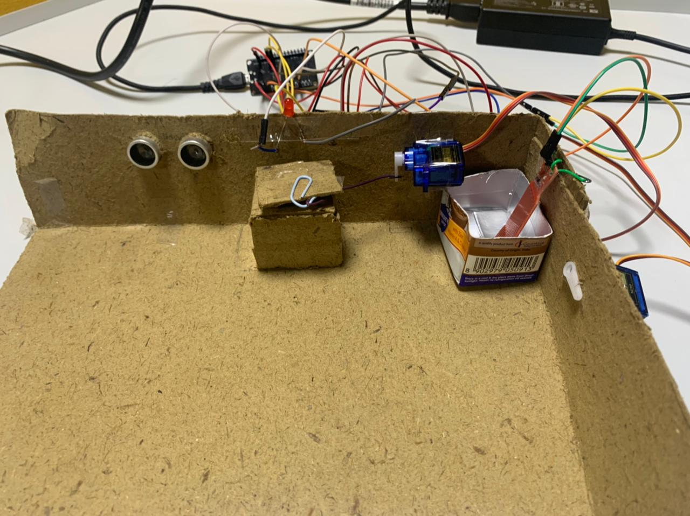
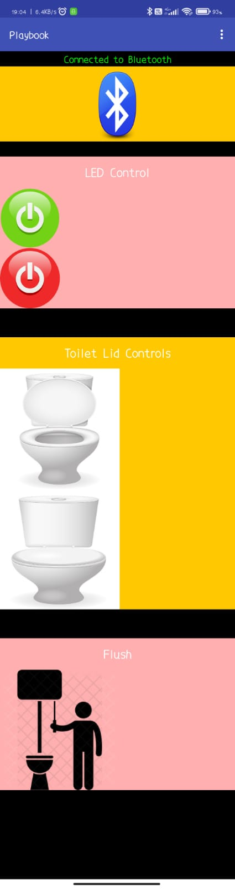

# IoT Project - Anush, Mukta, Ronak, Sriya

This repository contains our IoT group project made in my first year (July 2022).
The aim of the project was to create an end-to-end implementation of an IoT system.

## Project Idea

A “smart” bathroom with automated light, flushing, and lid actuating mechanisms. The bathroom can also be controlled via a mobile application.

## Project Components

- [x] Water Level Sensor
- [x] ESP32 Module
- [x] Ultrasonic Sensor
- [x] Servo Motors
- [x] LEDs

## Project Implementation

Implementation:
- When the user's distance is less than the threshold distance, the LED turns on and the servo motor rotates leading to the opening of the toilet lid.
- Then when the user’s distance exceeds the threshold distance, the LED turns off, the servo motor rotates again leading to the closing of the toilet lid, and another servo motor rotates leading to the activation of the flush.
- Initialize a  WiFi client to connect the ESP32 with onem2m server. Store content instances based on ultrasonic sensor readings in a resource tree inside the server.
- Initialize a Bluetooth client to connect the ESP32 with a mobile application . Send data through bluetooth to the ESP32 when an on-click event occurs in the app leading to control of the hardware.
- In the event that the user does not flush after leaving the toilet, the water level sensor detects this invariance in flush tank level and sends a message to the bathroom organizer.

#App

#### Contents:
- *Playbook*: Android App code

#### Brief Description of the project:
The app was created using the help of MIT App Inventor's codebase and allows for a simple UI interface design. Arduino code was integrated along with this app to demonstrate a proper IoT environment.

All this was tested on a prototype model with appropriate sensors like ultrasonic sensor, water level sensor, and ESP32.

